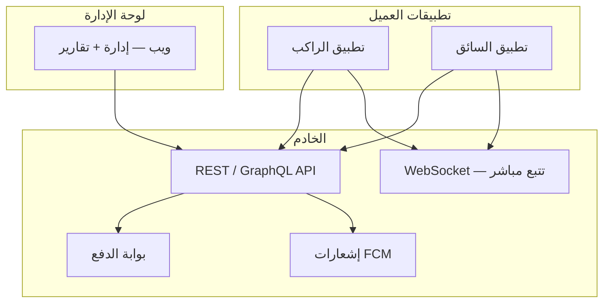
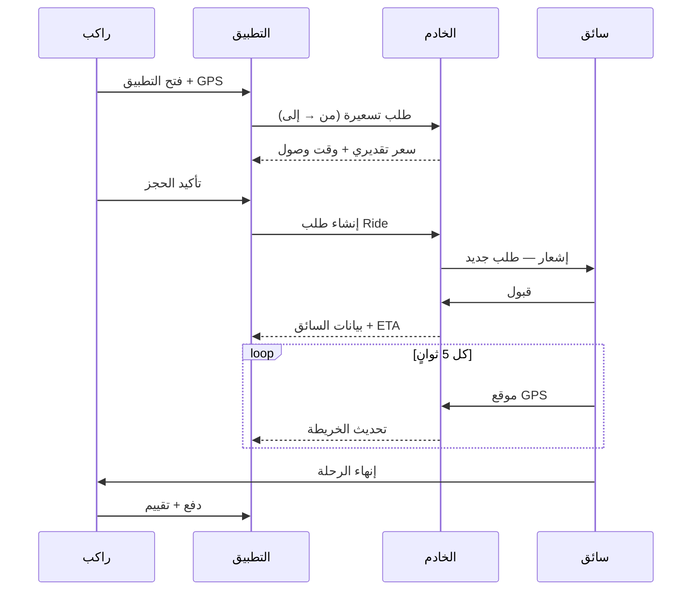
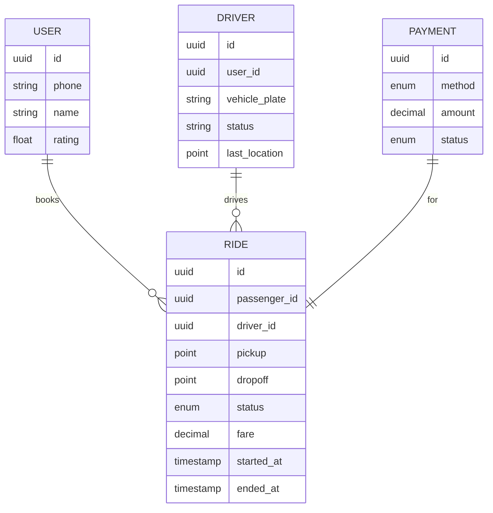

# تصميم تطبيق توصيل المفرق–عمان

> **الاسم المقترح:** مفرق إكس (MafraqX) — أو **سِرْ (Seer)** / **طريق (Tareeq)**
>
> تطبيق جوال لربط الركاب بسائقي سيارات خاصة على خط **المفرق ↔ عمان**، بنفس منطق أوبر وكريم وتكسي إف، مع تخصيص للمسافات بين المدن.

---

## 1. الرؤية والفكرة

### المشكلة
- خط المفرق–عمان (~80 كم) يخدم يومياً آلاف الركاب: طلاب، موظفين، زوار، تجار.
- التنقل الحالي يعتمد على **التكسي غير المنظم**، **الحافلات**، أو **الاتفاق الشفهي** — بدون شفافية في السعر، أمان، أو تتبع.
- تطبيقات مثل كريم وأوبر تركز على **المدينة** ولا تخدم **الخط بين المدن** بشكل مخصص.

### الحل
تطبيق **ثنائي الجانب** (راكب + سائق) يركز على:
- حجز رحلة من/إلى المفرق وعمان
- تسعير واضح (ثابت أو ديناميكي)
- تتبع GPS مباشر
- دفع نقدي + إلكتروني
- تقييمات وسلامة

### نموذج العمل
| المصدر | الوصف |
|--------|--------|
| عمولة على الرحلة | 15–20% من قيمة الرحلة |
| اشتراك السائق | اختياري — أولوية في الطلبات |
| رسوم إلغاء | بعد قبول السائق |
| شراكات | جامعات المفرق، مستشفيات، شركات |

---

## 2. أدوار المستخدمين



| الدور | الوصف |
|------|--------|
| **راكب** | يحجز رحلة، يتابع السائق، يدفع، يقيّم |
| **سائق** | يقبل طلبات، ينفّذ الرحلة، يستلم الأرباح |
| **مشرف** | يوثّق السائقين، يراجع الشكاوى، يضبط الأسعار |
| **دعم فني** | محادثة داخل التطبيق + هاتف |

---

## 3. أنواع الرحلات

| النوع | الوصف | السعر |
|------|--------|-------|
| **خاصة (Private)** | سيارة كاملة — باب لباب | أعلى — حسب المسافة + الوقت |
| **مشتركة (Shared)** | مقاعد في نفس الاتجاه — تجميع ركاب | أقل — لكل مقعد |
| **مجدولة (Scheduled)** | حجز مسبق (مثلاً 6 صباحاً يومياً) | خصم للاشتراك الأسبوعي |
| **عودة (Round-trip)** | ذهاب وإياب بنفس اليوم أو لاحقاً | خصم 10% |

### نقاط التوقف الشائعة (Geofences)
- **المفرق:** وسط المدينة، جامعة آل البيت، الحدود مع سوريا (معبر جaber)، المناطق الصناعية
- **عمان:** دوار الداخلية، عبدون، الجبيهة، ماركا، محطة باص المفرق–عمان

---

## 4. رحلة المستخدم (User Flows)

### 4.1 راكب — حجز فوري



### 4.2 سائق — دورة العمل

1. تسجيل دخول + التحقق من الهوية (مرة واحدة)
2. تفعيل "متاح" → يظهر على الخريطة
3. استلام طلب → 15 ثانية للقبول/الرفض
4. التوجيه (Google Maps / OSRM) إلى نقطة الالتقاط
5. "وصلت" → "بدء الرحلة" → "إنهاء"
6. عرض الأرباح اليومية/الأسبوعية

---

## 5. الميزات الأساسية (MVP)

### تطبيق الراكب
- [ ] تسجيل برقم الهاتف + OTP (Zain/Umniah/Orange — الأردن)
- [ ] خريطة — تحديد نقطة انطلاق ووصول (أو اختيار من قائمة)
- [ ] تقدير السعر والوقت قبل التأكيد
- [ ] مطابقة سائق + تتبع مباشر
- [ ] محادثة/اتصال مع السائق (بدون كشف الرقم — VoIP أو relay)
- [ ] دفع: **نقداً** + **بطاقة** (HyperPay / JoMoPay)
- [ ] سجل الرحلات + فواتير
- [ ] تقييم 1–5 + تعليق
- [ ] زر **SOS** — مشاركة الموقع مع جهة اتصال أو الدعم
- [ ] واجهة **عربية** (RTL) — إنجليزية اختيارية

### تطبيق السائق
- [ ] onboarding: هوية، رخصة، استمارة، تأمين، صورة شخصية
- [ ] حالة: متاح / مشغول / غير متصل
- [ ] قائمة طلبات + navigation
- [ ] محفظة — رصيد، سحب (CliQ / بنك)
- [ ] إحصائيات يومية

### لوحة الإدارة (ويب)
- [ ] الموافقة على السائقين
- [ ] خريطة حية لجميع الرحلات
- [ ] ضبط: عمولة، أساس التسعير، مناطق
- [ ] تقارير: رحلات، إيرادات، شكاوى
- [ ] إدارة promos

---

## 6. الميزات المتقدمة (مرحلة 2)

| الميزة | الفائدة |
|--------|---------|
| حجز متكرر (اشتراك أسبوعي) | طلاب جامعة آل البيت |
| تجميع ذكي (Shared pooling) | خفض السعر 40% |
| تسعير ديناميكي (peak hours) | صباح الجمعة، العودة مساءً |
| برنامج ولاء | نقاط → خصومات |
| دمج مع WhatsApp Business | إشعارات للمستخدمين بدون تطبيق |
| وضع offline جزئي | ضعف الشبكة على الطريق الصحراوي |

---

## 7. التسعير المقترح (نموذج أولي)

```
السعر = أساس ثابت + (كم × سعر/كم) + (دقيقة × سعر/دقيقة) + رسوم خدمة

مثال — خاصة المفرق → عمان (~80 كم):
  أساس: 2 JOD
  مسافة: 80 × 0.08 = 6.4 JOD
  وقت (~60 د): 60 × 0.02 = 1.2 JOD
  ─────────────────────────
  تقدير: ~9.6 JOD (+/- حسب ازدحام الطريق)

مشتركة (مقعد واحد): ~3–4 JOD
```

- **حد أدنى** للرحلة: 5 JOD
- **إلغاء مجاني** خلال 2 دقيقة من الطلب
- **إلغاء مدفوع** بعد قبول السائق: 1 JOD

---

## 8. السلامة والامتثال

| البند | التطبيق |
|-------|---------|
| توثيق السائق | هوية أردنية + رخصة سارية + فحص سجل |
| تتبع الرحلة | GPS كل 5 ث، مشاركة الرابط مع العائلة |
| SOS | اتصال + إرسال موقع للدعم |
| التأمين | شراكة مع شركة تأمين — وثيقة لكل مركبة |
| GDPR/خصوصية | سياسة خصوصية + حذف الحساب |
| ترخيص | التنسيق مع **هيئة تنظيم قطاع النقل** (أردن) |

---

## 9. البنية التقنية المقترحة

### Stack

| الطبقة | التقنية | السبب |
|--------|---------|-------|
| تطبيق الجوال | **React Native** (Expo) | iOS + Android، خريطة، RTL |
| Backend | **Node.js (NestJS)** أو **Go** | WebSocket، أداء |
| قاعدة بيانات | **PostgreSQL** + **PostGIS** | مواقع جغرافية |
| Cache/Queue | **Redis** | مطابقة السائقين، sessions |
| Real-time | **Socket.io** أو **Firebase** | تتبع الموقع |
| Maps | **Google Maps Platform** أو **Mapbox** | الأردن مدعوم جيداً |
| Auth | **Firebase Auth** أو OTP مخصص | رقم الهاتف |
| Push | **FCM** | Android + iOS |
| Hosting | **AWS** / **GCP** — region قريب (Bahrain) | latency |
| CI/CD | GitHub Actions | بناء ونشر |

### مخطط قاعدة البيانات (مبسّط)



### حالات الرحلة (State Machine)

```
REQUESTED → MATCHING → ACCEPTED → DRIVER_ARRIVED → IN_PROGRESS → COMPLETED
                ↓           ↓              ↓
            CANCELLED   CANCELLED      CANCELLED
```

---

## 10. تصميم الواجهة (UI/UX)

### المبادئ
- **بساطة:** 3 نقرات للحجز (من → إلى → تأكيد)
- **RTL أولاً:** خط Tajawal أو Cairo
- **ألوان:** أخضر/تركواز (ثقة، حركة) + أبيض — تجنب تشابه كامل مع المنافسين
- **offline-friendly:** رسائل واضحة عند ضعف الشبكة على الطريق

### الشاشات الرئيسية — راكب

```
┌─────────────────────────┐
│  ☰    مفرق إكس    🔔   │
├─────────────────────────┤
│                         │
│      [  خريطة  ]        │
│                         │
│  📍 من: المفرق، ...  ▼  │
│  📍 إلى: عمان، ...   ▼  │
│                         │
│  ┌─────────────────┐    │
│  │  خاصة  │ مشتركة │    │
│  └─────────────────┘    │
│                         │
│  ~9.5 د.أ  •  ~55 د    │
│  ┌─────────────────┐    │
│  │   احجز الآن     │    │
│  └─────────────────┘    │
└─────────────────────────┘
```

### الشاشات — سائق
- خريطة + زر كبير "متاح / غير متاح"
- بطاقة طلب منبثقة: المسافة، السعر، الوجهة — قبول/تخطي
- شاشة تنقل أثناء الرحلة

---

## 11. خوارزمية المطابقة (Matching)

```
1. فلترة: سائقون ONLINE + في نطاق 15 كم من نقطة الالتقاط
2. ترتيب: الأقرب → الأعلى تقييماً → الأقل رحلات اليوم (عدالة)
3. إرسال للأول — timeout 15 ث
4. إن رفض/انتهى الوقت → التالي
5. إن لا يوجد سائق → توسيع النطاق + إشعار "جاري البحث"
```

للرحلات **المجدولة**: مطابقة مسبقة قبل 30 دقيقة من الموعد.

---

## 12. خطة الإطلاق

| المرحلة | المدة التقنية | المحتوى |
|---------|---------------|---------|
| **0 — تحقق** | 2–3 أسابيع | 20 مقابلة مع مستخدمين، 5 سائقين تجريبيين |
| **1 — MVP** | 8–10 أسابيع | راكب + سائق + admin + نقدي فقط |
| **2 — Beta** | 4 أسابيع | 50 راكب، 10 سائقين — المفرق↔عمان فقط |
| **3 — دفع إلكتروني** | 3 أسابيع | HyperPay |
| **4 — توسع** | مستمر | Zarqa، Irbid، shared rides |

### KPIs
- وقت المطابقة < 3 دقائق
- إلغاء < 8%
- تقييم سائق > 4.5
- 500 رحلة/أسبوع (هدف 3 أشهر بعد الإطلاق)

---

## 13. المنافسة والتميز

| الم competitor | نقطة ضعف | تميزنا |
|----------------|----------|--------|
| كريم / أوبر | تركيز عمان داخلية | **تخصص خط المفرق–عمان** |
| تكسي تقليدي | لا تتبع، لا سعر ثابت | **شفافية + أمان** |
| حافلات | جداول ثابتة | **مرونة + باب لباب** |

**رسالة تسويقية:** *"من المفرق لعمان… بضغطة."*

---

## 14. هيكل المستودع المقترح (عند البدء بالتطوير)

```
mafraq-x/
├── apps/
│   ├── passenger/     # React Native — راكب
│   ├── driver/          # React Native — سائق
│   └── admin/           # Next.js — لوحة إدارة
├── packages/
│   ├── api/             # NestJS backend
│   ├── shared/          # types, utils, i18n
│   └── ui/              # مكونات مشتركة
├── docs/
│   └── DESIGN.md        # هذا الملف
└── infra/               # Docker, Terraform
```

---

## 15. الخطوة التالية

1. **اختيار الاسم** والهوية البصرية
2. **MVP scope:** تأكيد — نقدي فقط؟ خاصة فقط؟
3. **بدء التطوire:** scaffold React Native + NestJS
4. **شراكة:** 5–10 سائقين في المفرق للتجربة

---

*آخر تحديث: 2026-08-30*
